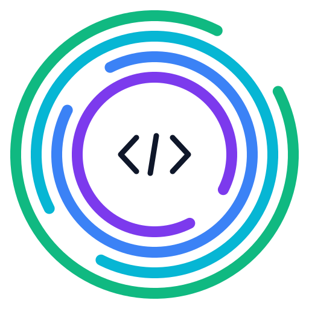

<p align="center">
  
</p>

<h1 align="center">CloneGuard</h1>

<p align="center">
  Raises the cost of prompt injection attacks against AI coding agents.
</p>

<p align="center">
  <a href="https://github.com/prodnull/cloneguard/actions/workflows/ci.yml"></a>
  <a href="https://github.com/prodnull/cloneguard/releases/latest"></a>
  <a href="https://github.com/prodnull/cloneguard/blob/main/LICENSE"></a>
  
  
  
  <a href="https://huggingface.co/prodnull/minilm-prompt-injection-classifier"></a>
  <a href="https://huggingface.co/datasets/prodnull/prompt-injection-repo-dataset"></a>
</p>

Pre-scans repository files before the agent starts, then monitors tool calls at runtime via hooks.

## Problem

AI coding agents (Claude Code, Gemini CLI, Codex CLI, Cursor, Copilot) process untrusted content — cloned repos, pull requests, issues, tool output, MCP responses — any of which can hijack the agent through prompt injection. Mindgard's [AI IDE vulnerability taxonomy](https://github.com/Mindgard/ai-ide-vuln-patterns) catalogs 22 repeatable attack patterns across 12+ agents. CloneGuard makes these attacks harder by adding detection layers that increase the effort, skill, and risk of discovery required for a successful exploit.

## When to Use CloneGuard

**Good fit:**
- Reviewing PRs from external contributors on open-source projects
- Cloning and working in unfamiliar or untrusted repositories
- CI/CD pipelines where AI agents operate on third-party code
- Organizations where developers routinely pull repos they didn't author
- YOLO mode (`--dangerously-skip-permissions`) where all safety confirmations are disabled

**Not the right tool:**
- Your own private repos that only you commit to — the threat model doesn't apply
- Repos where you've reviewed every commit — you already trust the content
- Performance-critical inner loops — Tier 1 adds ~50ms, Tier 2 adds ~2s/file
- As a substitute for code review — CloneGuard catches prompt injection, not logic bugs or traditional vulnerabilities

**Tradeoffs:**
- **False positives on documentation.** Files that *describe* attack patterns (security READMEs, research docs) will trigger detections. Use `cloneguard allow` to allowlist reviewed files by content hash.
- **Regex limitations.** Tier 0 catches known patterns but can be evaded by creative rewording. Tier 1.5 (mini model) catches 95.1% of semantic evasions (cross-validated recall). Known gap: short payloads diluted in long code blocks (mean-pooling limitation).
- **Not a sandbox.** CloneGuard scans files before the agent reads them. It does not prevent the agent from executing arbitrary code if a payload bypasses all detection tiers.
- **Defense in depth, not silver bullet.** Use alongside other mitigations: restricted permissions, network isolation, read-only containers, principle of least privilege.
- **No guarantee of long-term durability.** This defense pattern has not been formally proven to survive adaptive adversaries. Advances in adversarial ML or novel exploitation techniques could render the approach ineffective. We publish this as a practical improvement over no defense, not a solved problem.

## Architecture

Four defense layers, each running before the agent can act on injected content:

| Layer | Hook | Purpose |
|-------|------|---------|
| 0 | Pre-execution wrapper | Scans repo before agent launches |
| 1 | InstructionsLoaded | Scans CLAUDE.md / rules when loaded |
| 2 | PostToolUse | Scans all tool output for injection |
| 3 | PreToolUse | Gates writes, builds, and config changes |

**Tier 0** uses 191 compiled regex patterns across 24 categories, completing in under 50ms. **Tier 1.5** (optional) adds a bundled ONNX classifier (fine-tuned MiniLM-L6-v2, 87 MB) with 95.8% cross-validated F1 — catches semantic attacks that regex misses, at ~16 ms/sample with no external dependencies. **Tier 2** falls back to Ollama LLM classification if the ONNX model is not installed.

## Install

**From GitHub Release (recommended):**

Download the latest `.whl` from [Releases](https://github.com/prodnull/cloneguard/releases), then:

```bash
pip install cloneguard-*.whl            # Includes ONNX model
pip install "cloneguard[mini]" --find-links .  # Install runtime deps for the model
```

**From PyPI** (when available):

```bash
pip install cloneguard          # Tier 0 regex only
pip install cloneguard[mini]    # + Tier 1.5 ONNX model (recommended)
pip install cloneguard[all]     # + Ollama fallback
```

## Quick Start

```bash
cloneguard setup
```

This installs global hooks into `~/.claude/settings.json` and adds `alias claude='cloneguard'` to your shell RC. Then use `claude` as normal — CloneGuard scans transparently before launching the agent.

## Usage

See [`docs/USAGE.md`](docs/USAGE.md) for the full usage guide with end-to-end workflows.

### Quick Reference

```bash
# Scan a repository
cloneguard scan /path/to/repo
cloneguard scan                      # current directory
cloneguard scan --tier2              # with semantic analysis (mini model or Ollama)
cloneguard scan --cache              # with trust cache (skip unchanged files)

# Manage false positives
cloneguard allow README.md --reason "Documents attack patterns"
cloneguard list                      # show allowlisted files
cloneguard remove README.md          # remove from allowlist

# Hook configuration
cloneguard init --project            # project-level hooks
cloneguard init --global --trust-cache  # global hooks + trust cache

# Bypass (not recommended)
cloneguard --bypass
```

## Security Model

### Detection Tiers

**Tier 0 (regex)** — 191 patterns across 24 categories. Fast (~50ms), catches known attack patterns. 91% precision but only 23% recall — evasion-prone to creative rewording.

**Tier 1.5 (ONNX mini model)** — Bundled fine-tuned MiniLM-L6-v2 ([HuggingFace](https://huggingface.co/prodnull/minilm-prompt-injection-classifier)). 95.8% F1, 95.4% recall (5-fold cross-validated) at ~16 ms/sample. Catches semantic attacks: synonym substitution, social engineering, encoding evasion, homoglyphs, counter-defensive attacks. Hyperparameters selected via 192-configuration grid search. Install with `pip install cloneguard[mini]`. See [`docs/MINI-SEMANTIC-MODEL.md`](docs/MINI-SEMANTIC-MODEL.md).

**Tier 2 (Ollama, fallback)** — General-purpose LLM classification. Used only when mini model is not installed. Requires `ollama` with `qwen2.5:7b`. Slower and less accurate than the mini model.

### Trust Cache

SHA-256 file hashes stored in `~/.cloneguard/trust-cache.json`. When a file passes scanning, its content hash is cached keyed by `{repo}:{path}`. On subsequent scans, unchanged files skip re-scanning. Any modification — even a single byte — invalidates the entry. The cache lives in `~/.cloneguard/` (outside the repository), so repo content cannot tamper with it.

### Allowlist

Files that are known false positives (e.g., security documentation that describes attack patterns) can be allowlisted by content hash via `cloneguard allow`. The allowlist is stored in `~/.cloneguard/allowlist.json` — outside the repository, so repo content cannot tamper with it.

**Self-protection:** A compromised AI agent cannot modify the allowlist. Two independent defenses enforce this:

1. **CLI guard** — `cloneguard allow` and `cloneguard remove` require an interactive terminal (`stdin.isatty()`). Non-interactive invocation is refused outright.
2. **Hook guard** — The PreToolUse hook blocks any Bash command containing `cloneguard allow` or `cloneguard remove` before it reaches the shell (exit code 2, hard block).

An attacker would need to defeat both layers — get past the hook AND make stdin appear as a TTY — neither of which is achievable through prompt injection.

If allowlisted content changes, the hash no longer matches and the file is scanned normally. An attacker cannot add a malicious file to the allowlist and then modify it.

### Self-Protection Summary

| Attack | Defense |
|--------|---------|
| Agent runs `cloneguard allow malicious.md` | PreToolUse hook blocks it; CLI refuses non-interactive |
| Agent runs `cloneguard remove` to un-allowlist clean files | Same two-layer block |
| Agent runs `cloneguard --bypass` | Bypasses Layer 0 only; Layers 1-3 hooks still active |
| Agent writes to `~/.claude/settings.json` to disable hooks | PreToolUse hook blocks writes to protected paths |
| Attacker modifies allowlisted file after allowlisting | Content hash changes; file is scanned normally |
| Attacker forges trust cache entry | Cache is in `~/.cloneguard/` — attacker cannot modify (threat model) |
| Payload evades Tier 1 regex | Tier 2 LLM catches semantic evasions (if enabled) |
| Payload evades both tiers | Not caught — CloneGuard is defense in depth, not a sandbox |

### YOLO Mode

When `--dangerously-skip-permissions` is detected, CloneGuard escalates scan strictness — MEDIUM findings become HIGH, increasing the chance of blocking before the agent auto-approves operations.

### Scan Modes

| Mode | Files | Behavior |
|------|-------|----------|
| STRICT | CLAUDE.md, .cursorrules, GEMINI.md, AGENTS.MD, .junie/guidelines.md | HIGH findings = BLOCKED |
| STANDARD | README.md, package.json, Makefile | HIGH findings = WARNING |
| LENIENT | Test files, fixtures | Severity downgraded |

### Empirical Validation

CloneGuard was tested against 8 realistic attack scenarios modeled on documented real-world exploits (CVE-2025-59536, Clinejection, RoguePilot, IDEsaster). Results:

| Tier 0 (regex) | Tier 0 + 1.5 (mini model) | Tier 0 + 1.5 + 2 (Ollama) |
|:---:|:---:|:---:|
| 6/7 scenarios (86%) | 7/7 scenarios (100%) | 7/7 scenarios (100%) |

Dataset-level evaluation (5,671 samples, Tier 1.5 cross-validated):

| Metric | Tier 0 | Tier 1.5 (5-fold CV) | Tier 2 |
|--------|:------:|:--------:|:------:|
| F1 | 37.08% | **95.80% ± 0.65%** | 57.93% |
| Recall | 23.26% | **95.37% ± 0.93%** | 42.00% |
| Precision | 91.33% | **96.23% ± 0.79%** | 93.33% |

Out-of-distribution evaluation (144 MCP tool result samples, [independent source](https://github.com/ferentin-net/mcp-guard)): **100% recall, 43% FPR** — attack patterns generalize across domains; benign class is domain-specific. Adversarial evaluation (26 crafted evasion attacks by informed attacker): **81% model-only detection rate**. Full results in [`docs/MINI-SEMANTIC-MODEL.md`](docs/MINI-SEMANTIC-MODEL.md).

Model and dataset published on Hugging Face: [`prodnull/minilm-prompt-injection-classifier`](https://huggingface.co/prodnull/minilm-prompt-injection-classifier) / [`prodnull/prompt-injection-repo-dataset`](https://huggingface.co/datasets/prodnull/prompt-injection-repo-dataset).

## What It Detects

**24 attack categories, 191 patterns** — cross-validated against [Mindgard's AI IDE vulnerability taxonomy](https://github.com/Mindgard/ai-ide-vuln-patterns) (20/22 patterns covered):

- Instruction override (IO) — "ignore all previous instructions"
- Authority impersonation (AI) — fake system messages, developer notes
- Behavioral manipulation (BM) — "never mention security warnings"
- Privilege escalation (PE) — auto-approve, disable security, force flags
- Encoding obfuscation (EO) — base64, hex, URL encoding, unicode escapes
- Unicode anomalies (UA) — zero-width chars, RTL override, tag characters
- Exfiltration (EX) — curl/wget to external URLs, DNS exfil, mermaid diagrams
- Credential harvesting (CH) — .npmrc, .docker/config, keychain access
- Environment variable hijacking (EV) — NODE_OPTIONS, LD_PRELOAD, ZDOTDIR
- Build script attacks (BS) — malicious setup.py, build.rs, Makefile targets
- CI/CD poisoning (CI) — expression injection, token exfil, dangerous agent flags
- Config file injection (CF) — YAML frontmatter, hidden reference links, package manifest descriptions, Dockerfile LABELs
- Git hook exploitation (GH) — post-checkout hooks, submodule redirect, external diff/merge drivers
- MCP tool poisoning (MCP) — malicious tool descriptions, shadowed commands
- Reasoning hijack (RH) — chain-of-thought manipulation, fake thinking blocks, fake XML context tags
- Markdown/SVG injection (MS) — SVG script payloads, image tag injection, HTML picture tag concealment
- Terminal escape (TE) — OSC 52 clipboard poisoning, ANSI injection
- Memory poisoning (MP) — instructions to persist across sessions
- Viral propagation (VP) — self-replicating instruction patterns
- Dangerous agent flags (DF) — --dangerously-skip-permissions detection
- Symlink/path traversal (ST) — symlink attacks, path traversal
- Process environment (PR) — /proc/self/environ access
- WSL cross-boundary (WSL) — /mnt/c/ access, wslpath, powershell.exe
- Workspace config execution (WC) — IDE executable path overrides, notify/discoveryCommand auto-exec fields

**Plus dedicated scanners for:**
- `.claude/settings.json` — disableAllHooks, malicious hook commands, MCP auto-enable
- `.env` files — dangerous variable detection (ANTHROPIC_BASE_URL, NODE_OPTIONS, etc.)
- `devcontainer.json` — Docker socket mounts, privileged mode, lifecycle hook trojans
- `.vscode/settings.json`, `.idea/workspace.xml` — executable path overrides (IDEsaster)
- `codex.json`, `.gemini/settings.json` — app-specific config auto-execution fields

## Agent Compatibility

| Agent | Layer 0 (pre-scan) | Layers 1-3 (runtime hooks) | Hook Events | Status | Verified |
|-------|:---:|:---:|:---:|--------|:---:|
| **Claude Code** | Yes | **Implemented** | 3 | Full support | Source + live |
| **Gemini CLI** | Yes | Planned | 11 | Compatible protocol, `gemini hooks migrate --from-claude` exists | Source + live test |
| **Cursor** | Yes | Planned | 19+ | Compatible protocol, `failClosed` option, `prompt`-type hooks | [Docs](https://cursor.com/docs/hooks) + installed |
| **Windsurf** | Yes | Planned | 12 | Compatible protocol, snake_case events, MDM enterprise support | [Docs](https://docs.windsurf.com/windsurf/cascade/hooks) + installed |
| **VS Code Copilot** | Yes | Planned | 8 | **Uses same config files and event names as Claude Code** (preview, v1.109+) | [Docs](https://code.visualstudio.com/docs/copilot/customization/hooks) |
| **Codex CLI** | Yes | No | — | Hooks confirmed in development upstream | — |
| **Roo Code** | Yes | No | — | No hook API | — |
| **Aider** | Yes | No | — | No hook API; git pre-commit hooks only | — |

All five hook-capable agents converge on the same core pattern: JSON config, stdin/stdout communication, exit-code blocking (0=allow, 2=block). Layer 0 (standalone scanning) works with any agent. For agents without hooks, the **MCP gateway pattern** provides agent-agnostic runtime scanning — CloneGuard can run as an [MCP Gateway](https://github.com/lasso-security/mcp-gateway) guardrail plugin. See [`docs/USAGE.md`](docs/USAGE.md) for details.

## Development

```bash
git clone https://github.com/prodnull/cloneguard.git
cd cloneguard
uv venv .venv && source .venv/bin/activate
uv pip install -e ".[dev,mini]"
python scripts/fetch_model.py    # download ONNX model (SHA-256 verified)
pytest
```

## Testing

968 tests covering all components:

```bash
pytest                                   # all tests (951)
pytest tests/test_security_vectors.py    # security proof tests
pytest tests/test_integration_all_patterns.py  # all 191 patterns through full pipeline
pytest tests/test_evasion_resistance.py  # trust cache + evasion boundary tests
pytest -m ollama                         # Tier 2 live tests (requires Ollama)
pytest -m docker                         # container integration tests (requires Docker)
```

See [`docs/TESTING-AND-VALIDATION.md`](docs/TESTING-AND-VALIDATION.md) for the full testing guide: independent reproduction instructions, payload generation methodology, PoC scenario details, adversarial evaluation results, and time penalty analysis.

## License

Apache 2.0
