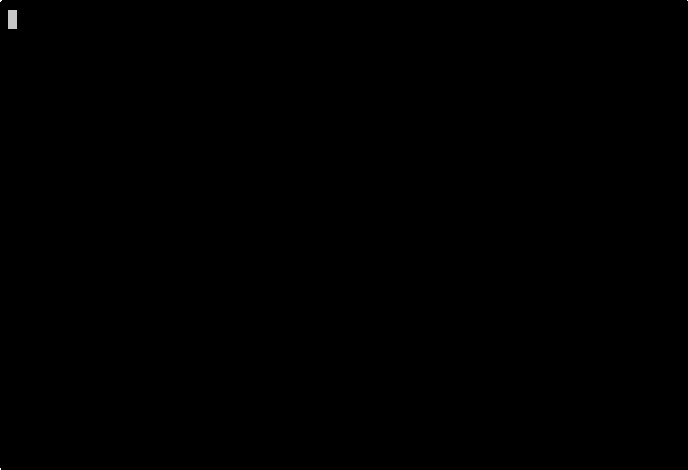

<p align="center">
  
</p>

<h1 align="center">CloneGuard</h1>

<p align="center">
  Your AI agent reads untrusted repos. CloneGuard watches what it does next.
</p>

<p align="center">
  <a href="https://pypi.org/project/cloneguard/"></a>
  
  <a href="https://github.com/prodnull/cloneguard/actions/workflows/ci.yml"></a>
  
  <a href="https://github.com/prodnull/cloneguard/blob/main/LICENSE"></a>
</p>

Hook-level defense for AI coding agents. Detects prompt injection, constrains
suspicious tool calls, and emits structured audit logs -- before the agent
executes. The agent cannot disable it because CloneGuard runs at the hook layer,
outside the agent's control.

Works with Claude Code, Gemini CLI, and Cursor. Active development (v0.6.0) --
feedback and contributions welcome.

## See It In Action

<p align="center">
  
  <br>
  <em>A repo with a hidden .clinerules payload — CloneGuard catches it on scan.</em>
</p>

<details>
<summary>More demos</summary>

**Behavioral sequence detection** — reads .env, then tries to curl the data out. First step allowed, second step blocked.


**Package hallucination** — agent tries to install a package that doesn't exist on PyPI.


</details>

## Quick Start

```bash
pip install cloneguard
cloneguard init --global
```

That's it. CloneGuard is now scanning every tool call in Claude Code. No config
files to write, no agent restart required.

Want the semantic classifier (recommended):

```bash
pip install "cloneguard[mini]"
```

## What It Catches

- **Prompt injection patterns** -- 240 rules across 34 categories, from
  instruction override to reasoning hijack to MCP tool poisoning
- **Behavioral sequences** -- credential file read followed by network
  exfiltration attempt (SEQ-001), config writes for privilege escalation
  (SEQ-005), and more
- **Package hallucination** -- agent tries to install a package that doesn't
  exist on PyPI/npm. If an attacker had registered that name first, you'd be
  running their code
- **Sensitive file access** -- detects reads of credentials, SSH keys, and
  environment files in suspicious context

## How It Works

Four defense layers, each running before the agent can act:

```
Layer 0  Pre-execution     Scans repo files before agent launches
Layer 1  InstructionsLoaded Scans CLAUDE.md / rules files when loaded
Layer 2  PostToolUse        Scans all tool output for injected instructions
Layer 3  PreToolUse         Gates writes, builds, and config changes
```

**Detection signals:**

| Signal | What | Speed |
|--------|------|-------|
| Pattern matching | 240 compiled regex rules, 34 categories | <50ms |
| Semantic classifier | Fine-tuned MiniLM-L6-v2 ONNX model (94.3% F1) | ~16ms/sample |
| Behavioral sequences | CaMeL-lite session-wide tool-call monitoring | <0.5ms/event |

When a detection fires, CloneGuard can report it (default), constrain the tool
call via OS-level sandbox, or block it outright -- configurable per-rule and
per-severity via YAML policy.

False positive rates validated against 208,127 real coding-agent sessions from
published SWE-bench datasets (SEQ-001 FPR: 0.0024%).

## Also Works With

| Platform | Status |
|----------|--------|
| **Claude Code** | Full runtime hook support (Layers 0-3) |
| **Gemini CLI** | Hook-compatible, `gemini hooks migrate --from-claude` |
| **Cursor** | Hook-compatible, `failClosed` support |
| **Windsurf** | Hook-compatible |
| **VS Code Copilot** | Hook-compatible (preview, v1.109+) |
| **GitHub Actions** | SARIF upload to Security tab |
| **MCP** | Gateway middleware adapter |
| **Any agent** | Layer 0 standalone scan: `cloneguard scan /path/to/repo` |

## Enforcement

CloneGuard defaults to detection-only mode (dry-run). When enforcement is
enabled, tool calls receive one of three verdicts:

| Verdict | Meaning | Default action |
|---------|---------|----------------|
| SAFE | No signals fired | Allow |
| SUSPICIOUS | Low-confidence match | Constrain (sandbox) |
| MALICIOUS | High-confidence match | Block |

Constraint uses OS-level sandboxing -- Landlock on Linux, Seatbelt on macOS --
to restrict filesystem and network access for the tool call subprocess without
affecting CloneGuard itself. Additional adapters available for Docker, gVisor,
Firecracker, and WASM isolation.

Configure via `~/.cloneguard/policy.yaml`. See the
[policy engine docs](https://prodnull.github.io/cloneguard/guides/policy-engine/)
for details.

## Development Status

CloneGuard is in active development. The core detection engine is tested against
240 rules, 1,677 automated tests, and adversarial evaluations including
multi-model red teaming. False positive rates were calibrated against 208,127
real coding-agent sessions from published SWE-bench datasets.

Enterprise features (OPA/Cedar policy backends, SIEM connectors, fleet
deployment tooling) are early-stage and should be considered experimental.

Known limitations are documented in the
[evaluation section](https://prodnull.github.io/cloneguard/evaluation/limitations/)
of the docs site.

## Development

```bash
git clone https://github.com/prodnull/cloneguard.git
cd cloneguard
uv venv .venv && source .venv/bin/activate
uv pip install -e ".[dev,mini]"
pytest
```

## Documentation

Full documentation at [prodnull.github.io/cloneguard](https://prodnull.github.io/cloneguard/).

- [Getting Started](https://prodnull.github.io/cloneguard/getting-started/claude-code/) -- 5-minute setup for Claude Code
- [Architecture](https://prodnull.github.io/cloneguard/architecture/overview/) -- defense layers, signal flow, enforcement pipeline
- [Evaluation](https://prodnull.github.io/cloneguard/evaluation/methodology/) -- adaptive red team methodology and results
- [Limitations](https://prodnull.github.io/cloneguard/evaluation/limitations/) -- what CloneGuard does not catch

## Background

- [Making Prompt Injection Harder Against AI Coding Agents](https://medium.com/@cbchhaya/making-prompt-injection-harder-against-ai-coding-agents-f4719c083a5c) -- architecture and design decisions
- [What Happens When Someone Tries to Break It](https://medium.com/@cbchhaya/cloneguard-what-happens-when-someone-tries-to-break-it-5e69072ed0e4) -- adversarial hardening
- [From Catching Payloads to Catching Behavior](https://medium.com/@cbchhaya/from-catching-payloads-to-catching-behavior-122f6cf3399b) -- behavioral pivot
- [What Claude Code's Leaked Permission Classifier Misses](https://medium.com/@cbchhaya/what-claude-codes-leaked-permission-classifier-misses-and-what-fills-the-gap-c6dd3650163c) -- gap analysis

## License

[Apache 2.0](LICENSE)
